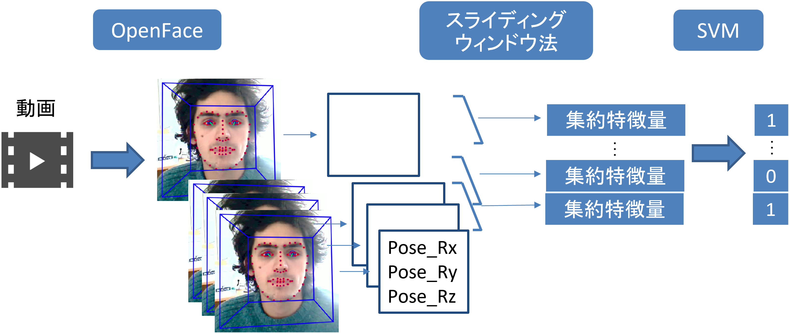

頷き検出アルゴリズム
=========================

概要
------

- ミーティング動画からOpenFaceによって各話者の顔情報をフレームごとに検出
- OpenFaceの顔情報のうち、顔の角度であるヨー(Pose_Rx)、ピッチ(Pose_Ry)、ロー(Pose_Rz)を利用
- ヨー・ピッチ・ローの情報から、スライディングウィンドウ法により、隣接するフレームの情報を加味した特徴量を抽出
- SVMにより頷きあり・なしの２値分類を判定

参考：https://yukimat.jp/data/pdf/paper/DisCaaS_c_202003_soneda_ubi65.pdf

学習データセット作成
-----

- ずっと頷いている/頷いていない動画を複数撮る
    - アノテーションを楽にするため、nod_1, nod_2, ... , other_1, other_2, ...のようにずっと頷く/頷かない動画に分けて撮影する
    - 複数人で同時に頷く動画を撮影してもよいが、1人を推奨する

- [`OpenFace service`](https://github.com/jeffshee/icer/tree/honda_openface/openface_preprocess)を利用して、
各動画でOpenFace情報（csvファイル）を出力

- `feature_engineering.py`によってスライディングウィンドウ法による特徴量（csvファイル）を出力
    - 複数人で同時に頷く動画を撮影した場合、ここで`read_multi.py`を利用して特徴量を抽出する

- `nod_detection_single.ipynb`で学習・バリデーションを実行

テスト（実際の動画で推論）
-----

- テスト動画を[`OpenFace service`](https://github.com/jeffshee/icer/tree/honda_openface/openface_preprocess)によって
OpenFace情報にし、`read_multi.py`によって各話者ごとの特徴量（csvファイル）を出力させる

- `nod_detection_multi.ipynb`で学習・テストを実行
