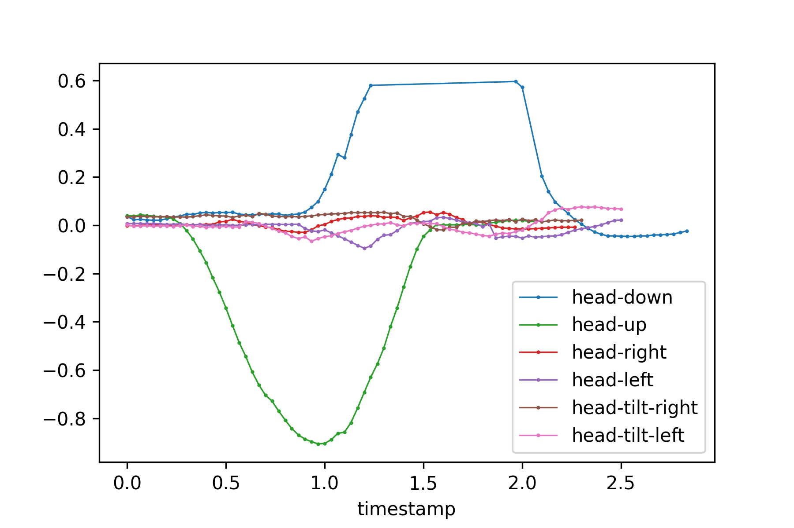
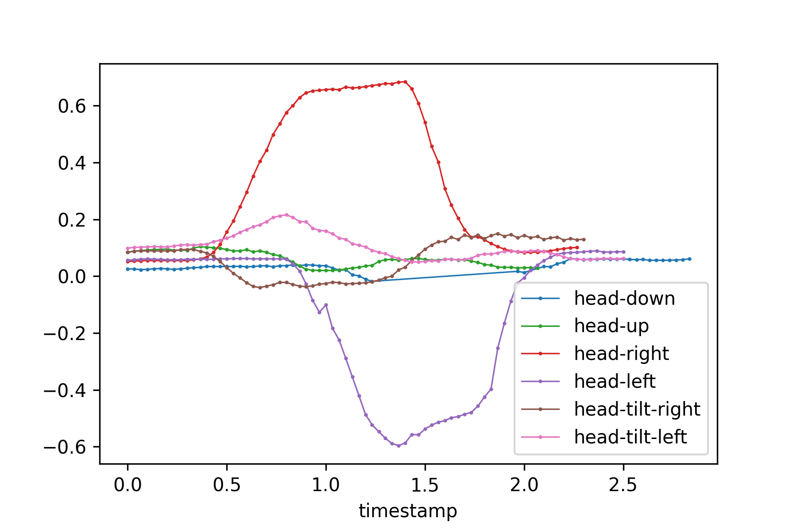
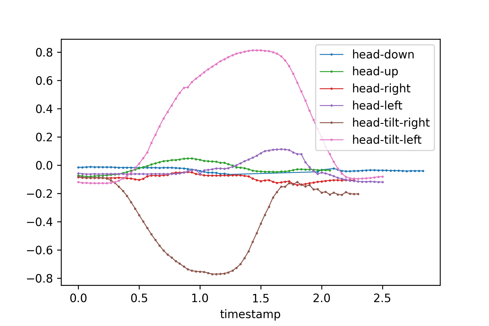

# OpenFace
paper: https://www.cl.cam.ac.uk/research/rainbow/projects/openface/wacv2016.pdf \
code: https://github.com/TadasBaltrusaitis/OpenFace


## Setup
```
docker run -it --rm --name openface algebr/openface:latest
```
https://github.com/TadasBaltrusaitis/OpenFace/wiki/Docker


## Output Format (CSV)
https://github.com/TadasBaltrusaitis/OpenFace/wiki/Output-Format

### Rotation-xyz example (From Output csv)

### **Rotation-x**


### **Rotation-y**


### **Rotation-z**


## Execution
https://github.com/TadasBaltrusaitis/OpenFace/wiki/Command-line-arguments

Ex.
If output landmarks of the video which containes multiple faces.\
The results output to processed directory (default).


**1. Copy video file from local into docker container**
```
docker cp /local_video_dir/video.avi CONTAINER-ID:docker_vid_dir/
```

**2. Run scrpit**
```
# For many faces
build/bin/FaceLandmarkVidMulti -f "/docker_video_dir/video.avi"

# For single face
build/bin/FeatureExtraction -f "/docker_video_dir/video.avi"
```

**3. Copy results from docker container into local**
```
docker cp CONTAINER-ID:docker_results_dir/ /local_results_dir/
```